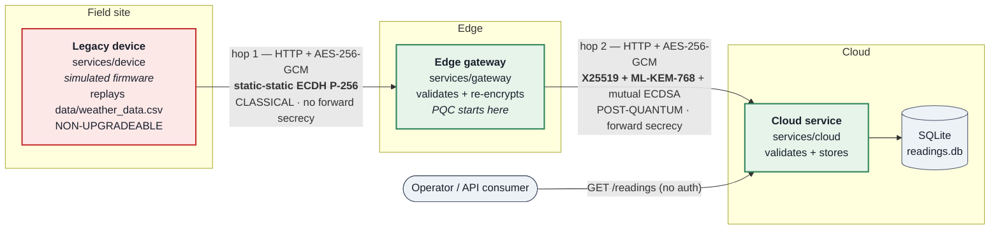
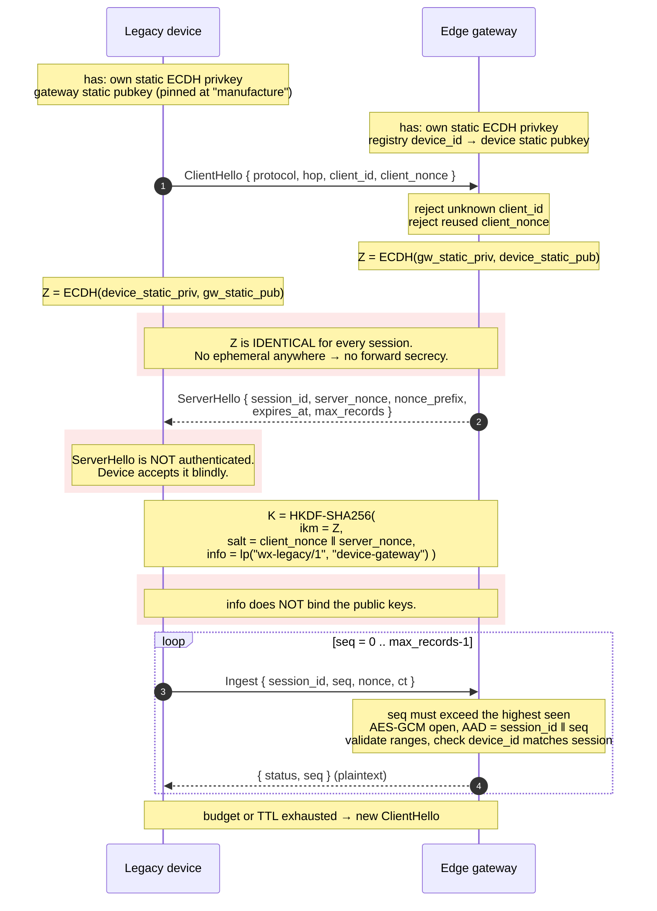
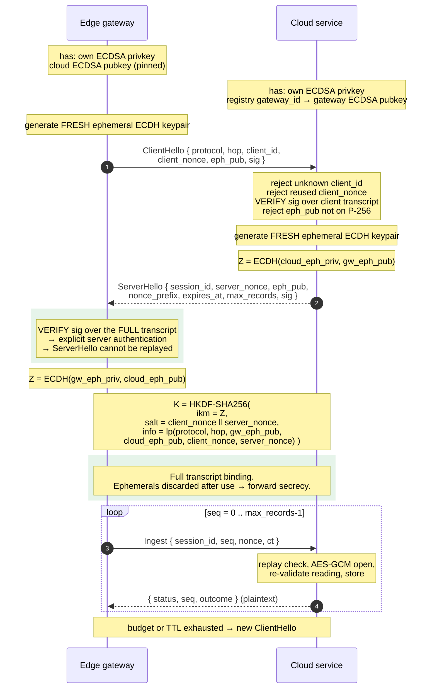
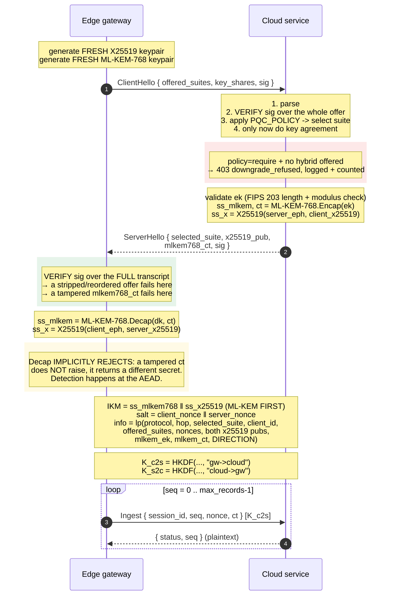

# Architecture

Weather telemetry: a simulated legacy device, an edge gateway, and a cloud
service.

**Status:** hop 2 (gateway → cloud) does **hybrid post-quantum** key
establishment with X25519 + ML-KEM-768. Hop 1 (device → gateway) is still
classical, because the device is non-upgradeable by premise.

> **The system as a whole is not post-quantum secure.** Hop 2 is. Traffic
> recorded on hop 1 today remains decryptable by a future quantum computer.
> See [MIGRATION.md](MIGRATION.md) for exactly what is and is not protected.

Not production software. Do not copy the hop 1 design into anything new.

| Section | Covers |
|---|---|
| §1–2 | components, and why the hops differ |
| §3–4 | message formats and handshake sequences (hop 1, hop 2 v1, hop 2 v2) |
| §5 | suite negotiation, PQC policy, downgrade protection |
| §6–8 | sessions, data flow, read API |
| §9–10 | weaknesses (W1–W20) and what humans must verify |

---

## 1. Components



| Component | Role | Key establishment | Post-quantum? | Upgradeable? |
|---|---|---|---|---|
| `services/device` | Replays 366 daily readings | static-static ECDH P-256 | **No** | **No** — frozen firmware |
| `services/gateway` | Validates, re-encrypts, forwards | hop 1 server + hop 2 client | hop 2 only | Yes |
| `services/cloud` | Validates, stores, serves read API | hop 2 server | Yes | Yes |

Authentication on both hops is **ECDSA P-256**, which is *not* post-quantum.
That is a deliberate, recorded limitation — see §5.3 and W3.

The gateway is a **decrypt/re-encrypt point**. Plaintext readings exist in its
memory. This is not end-to-end confidentiality — and it is precisely what makes
a staged PQC migration possible, because the device never has to change.

---

## 2. Why the two hops differ

This is the central design decision of the system, and it is what made the
migration possible without touching the device.

| | Hop 1 (device → gateway) | Hop 2 (gateway → cloud) |
|---|---|---|
| Protocol | `wx-legacy/1` | `wx-hybrid/2` (`wx-legacy/1` still accepted) |
| Key agreement | static-static ECDH P-256 | **X25519 + ML-KEM-768** |
| **Post-quantum** | **no** | **yes** |
| Forward secrecy | **none** | yes (fresh ephemerals both halves) |
| Client auth | implicit (static ECDH key *is* the identity) | explicit (ECDSA P-256 signature) |
| Server auth | implicit (pinned static key) | **explicit** (ECDSA over full transcript) |
| ServerHello authenticated | **no** | yes |
| Suite negotiation | none | yes, with downgrade protection |
| KDF transcript binding | nonces only — **public keys not bound** | full transcript + offer list |
| Keys per session | one (strictly one-way) | **two** (one per direction) |
| AEAD | AES-256-GCM | AES-256-GCM |

**Hop 1 is deliberately cruftier and is frozen.** It models non-upgradeable
firmware honestly: a key burned in at manufacture, no ephemerals, no signatures,
no negotiation. Every session between this device and this gateway derives from
the *same* ECDH shared secret `Z`; only the HKDF salt varies.

**Hop 2 was built as a clean classical baseline precisely so that ML-KEM could
be dropped into it.** The migration changed one derivation function and the two
handshake messages. Hop 1, the device, the AEAD framing, validation, storage and
the read API did not move — which is why the before/after benchmark isolates the
cost of the KEM and nothing else.

The classical fallback suite `classical-p256` *is* the old hop 2, kept so the
comparison stays honest and so Phase 1 of the migration is demonstrable.

---

## 3. Message formats

All messages are JSON over HTTP. Binary fields are base64 (standard alphabet,
padded, strictly validated on decode).

Transcripts that are hashed or signed use **length-prefixed concatenation**
(`services/common/wire.py::lp`): each part is a 4-byte big-endian length
followed by its bytes. Without this, `("ab","c")` and `("a","bc")` would produce
identical bytes and a signature over one would verify over the other.

### 3.1 Hop 1 — ClientHello (`POST /handshake` on the gateway)

```json
{
  "protocol": "wx-legacy/1",
  "hop": "device-gateway",
  "client_id": "device-berlin-01",
  "client_nonce": "<b64, 16 bytes>"
}
```

No ephemeral key and no signature. The device is identified by `client_id` and
authenticated *implicitly* — the gateway looks up that device's static ECDH
public key, and only the genuine device can derive the matching session key.

### 3.2 Hop 1 — ServerHello

```json
{
  "protocol": "wx-legacy/1",
  "session_id": "<b64, 16 bytes>",
  "server_nonce": "<b64, 16 bytes>",
  "nonce_prefix": "<b64, 4 bytes>",
  "expires_at": "2026-09-21T10:05:00Z",
  "max_records": 100
}
```

**Unauthenticated.** An on-path attacker can forge this. The device accepts it
without checking anything, and only discovers a wrong gateway when its first
message comes back with a tag failure.

> **§3.3 and §3.4 describe `wx-legacy/1`, the pre-PQC hop 2 handshake.** It is
> still accepted for backwards compatibility but is refused under
> `PQC_POLICY=require`. The current protocol is §4.3.

### 3.3 Hop 2 v1 (legacy) — ClientHello (`POST /handshake` on the cloud)

```json
{
  "protocol": "wx-legacy/1",
  "hop": "gateway-cloud",
  "client_id": "gw-01",
  "client_nonce": "<b64, 16 bytes>",
  "eph_pub": "<b64, X9.62 uncompressed P-256 point, 65 bytes>",
  "sig": "<b64, ECDSA-P256-SHA256, DER>"
}
```

`sig` covers:

```
lp( "wx-legacy/1", "gateway-cloud", "client-hello",
    client_id, client_nonce, eph_pub )
```

### 3.4 Hop 2 v1 (legacy) — ServerHello

```json
{
  "protocol": "wx-legacy/1",
  "session_id": "<b64, 16 bytes>",
  "server_nonce": "<b64, 16 bytes>",
  "eph_pub": "<b64, 65 bytes>",
  "nonce_prefix": "<b64, 4 bytes>",
  "expires_at": "2026-09-21T10:05:00Z",
  "max_records": 100,
  "sig": "<b64, ECDSA-P256-SHA256, DER>"
}
```

`sig` covers the **full transcript**, including the client's contribution:

```
lp( "wx-legacy/1", "gateway-cloud", "server-hello",
    client_id, client_nonce, client_eph_pub,
    session_id, server_nonce, server_eph_pub,
    nonce_prefix, expires_at, max_records )
```

Because the client's nonce and ephemeral key are inside the signature, a captured
ServerHello cannot be replayed into a different session. This is the explicit
server authentication that substitutes for what TLS would otherwise provide.

### 3.5 Data message (`POST /ingest`, both hops)

```json
{
  "session_id": "<b64, 16 bytes>",
  "seq": 0,
  "nonce": "<b64, 12 bytes = nonce_prefix(4) || seq_be(8)>",
  "ct": "<b64, AES-256-GCM ciphertext || 16-byte tag>"
}
```

- **AAD** = `session_id || seq_be(8)` — so the sequence number is authenticated
  and a ciphertext cannot be moved to a different position in the stream.
- **Nonce uniqueness** is structural: a random 4-byte prefix per session plus a
  counter that never repeats within that session. The receiver requires
  `seq` to be strictly increasing and recomputes the expected nonce itself.

### 3.6 Hop 1 plaintext — one reading

```json
{
  "device_id": "device-berlin-01",
  "station": { "lat": 52.54833, "lon": 13.407822, "elev_m": 38.0, "tz": "Europe/Berlin" },
  "sent_at": "2026-09-21T10:00:02Z",
  "date": "2024-01-01",
  "temp_max_c": 7.4,
  "temp_min_c": 3.4,
  "precip_mm": 1.80,
  "wind_max_kmh": 19.7
}
```

### 3.7 Hop 2 plaintext — gateway envelope

```json
{
  "gateway_id": "gw-01",
  "device_id": "device-berlin-01",
  "reading": { "date": "2024-01-01", "temp_max_c": 7.4, "temp_min_c": 3.4,
               "precip_mm": 1.80, "wind_max_kmh": 19.7 },
  "station": { "lat": 52.54833, "lon": 13.407822, "elev_m": 38.0, "tz": "Europe/Berlin" },
  "received_at": "2026-09-21T10:00:02Z",
  "device_hop": { "verified": true, "suite": "ECDH-P256-static-static+AES-256-GCM" }
}
```

`device_hop.verified` is the gateway **asserting** that hop 1 authenticated. The
cloud has no independent way to check this — see weakness W7.

### 3.8 Responses

```json
{ "status": "accepted", "seq": 0, "outcome": "stored" }
{ "status": "rejected", "seq": 0, "reason": "validation_failed" }
```

Reasons: `malformed_message`, `malformed_payload`, `malformed_envelope`,
`session_expired`, `replay`, `bad_tag`, `validation_failed`, `device_id_mismatch`.

Responses are **plaintext and unauthenticated** on both hops (W5).

---

## 4. Handshake sequences

### 4.1 Hop 1 — device → gateway (static-static, no forward secrecy)



### 4.2 Hop 2 — gateway → cloud (ephemeral ECDHE + mutual ECDSA)



### 4.3 Hop 2 v2 — hybrid X25519 + ML-KEM-768 (`wx-hybrid/2`)

The current hop 2 protocol. `wx-legacy/1` (§4.2) is still accepted, so an
un-upgraded gateway keeps working — but under `PQC_POLICY=require` it is refused
as a downgrade.

**ClientHello** — offers every suite it can do, with a key share for each, so
negotiation costs no extra round trip:

```json
{ "protocol": "wx-hybrid/2", "hop": "gateway-cloud", "client_id": "gw-01",
  "client_nonce": "<b64 16B>",
  "offered_suites": ["hybrid-x25519-mlkem768", "classical-p256"],
  "key_shares": {
    "hybrid-x25519-mlkem768": { "x25519_pub": "<b64 32B>",
                                "mlkem768_ek": "<b64 1184B>" },
    "classical-p256":         { "eph_pub": "<b64 65B>" }
  },
  "sig": "<b64 ECDSA-P256 over protocol, hop, client_id, nonce,
           offered_suites AND every key share>" }
```

**ServerHello:**

```json
{ "protocol": "wx-hybrid/2", "selected_suite": "hybrid-x25519-mlkem768",
  "session_id": "<b64 16B>", "server_nonce": "<b64 16B>",
  "x25519_pub": "<b64 32B>", "mlkem768_ct": "<b64 1088B>",
  "nonce_prefix": "<b64 4B>", "expires_at": "...", "max_records": 100,
  "sig": "<b64 ECDSA-P256 over the FULL transcript, including the client's
           offered_suites and key shares>" }
```

For `classical-p256` the server returns `eph_pub` instead of
`x25519_pub`/`mlkem768_ct`.



**Why ML-KEM's secret comes first.** NIST SP 800-56C Rev2 permits HKDF over two
shared secrets provided the FIPS-approved one leads. TLS's `X25519MLKEM768`
orders it the same way.

**Why two keys.** Both directions share a session id and nonce prefix, so a
single key would mean message N in each direction reused the same (key, nonce)
pair — catastrophic for AES-GCM. Only `K_c2s` carries data today; `K_s2c` is
derived so a future encrypted response cannot reuse the sending key.

**Sizes.** The hybrid handshake is 3959 B against 710 B classical (+458%). The
per-message frame is **unchanged at 416 B** — ML-KEM establishes a key and never
touches the payload, as `CLAUDE.md` requires.

---

## 5. Suite negotiation and downgrade protection

### 5.1 Suites and policy

| Suite ID | Key establishment | Post-quantum? |
|---|---|---|
| `hybrid-x25519-mlkem768` | X25519 ECDHE + ML-KEM-768 | **Yes** |
| `classical-p256` | P-256 ECDHE | No |

`PQC_POLICY`, set independently on each service:

| Value | Behaviour | Default |
|---|---|---|
| `require` | Hybrid only. Classical-only peers get `403 downgrade_refused`. | **cloud** |
| `prefer` | Hybrid if possible; classical logged at WARNING and counted. | **gateway** |
| `classical-only` | Explicit opt-out. Logs a startup banner. | — |

Visible on `GET /stats` as `pqc.handshakes_hybrid`, `pqc.handshakes_classical`,
`pqc.handshakes_downgrade_refused` and `pqc.pqc_fraction`.

### 5.2 Three layers

1. **Signature.** The gateway signs its whole offer; the cloud signs the full
   transcript including that offer. Stripping or reordering `offered_suites`
   breaks both signatures.
2. **KDF binding.** `offered_suites` and `selected_suite` are in the HKDF info,
   so a mismatch yields different keys and fails at the AEAD.
3. **Policy.** The cloud simply refuses. Enforced on both ends — a gateway on
   `require` rejects a correctly signed classical ServerHello, because either
   peer may be the one that was rolled back.

### 5.3 The limitation, stated precisely

Layers 1 and 2 rest on **ECDSA P-256, which is quantum-broken**. Therefore:

- **Recorded hybrid traffic stays confidential.** Session keys come from
  `ss_mlkem768 ‖ ss_x25519`; forging ECDSA reveals neither. Harvest-now-
  decrypt-later protection on hop 2 **holds**.
- **ECDSA's weakness enables ACTIVE attacks only, and only once a CRQC exists** —
  real-time impersonation, MITM and forced downgrade, all requiring the attacker
  on-path *at handshake time*. None of it decrypts anything recorded earlier.

Only layer 3 survives a CRQC: a forged signature buys a *refused* handshake, not
a downgraded one. Full treatment in [MIGRATION.md](MIGRATION.md) §2.

---

## 6. Session lifetime and rekeying

A session is the scope of one AEAD key. It ends at whichever comes first:

| Limit | Default | Env var |
|---|---|---|
| Records sent | 100 | `MAX_RECORDS_PER_SESSION` |
| Wall-clock age | 600 s | `SESSION_TTL_SECONDS` |

The client re-handshakes proactively when it hits either limit; if the server has
already dropped the session it answers `409 session_expired` and the client
re-handshakes and retries once.

Rekeying bounds how much data one derived key protects. On hop 1 it does **not**
bound the damage from a compromised static key, because every session key is
recomputable from `Z` plus the nonces, which travel in the clear.

**Ephemeral key rotation on hop 2** is the property that matters for the PQC
path: a **fresh ML-KEM-768 keypair and a fresh X25519 keypair per handshake**,
discarded immediately afterwards. Reusing either across sessions would forfeit
forward secrecy on that half. Asserted by
`test_every_handshake_uses_a_fresh_mlkem_keypair`.

The session budget was deliberately left at 100 records / 600 s rather than
shortened, so the before/after benchmark compares like with like. Hybrid
handshakes cost ~3.2 KB more, amortised to roughly 32 bytes per reading at that
budget — negligible here, but a real consideration on a constrained link.

Long-term ECDSA keys still have no rotation path (W11, unchanged).

Counter exhaustion is not a practical concern: the 8-byte counter allows 2⁶⁴
messages per session against a budget of 100.

---

## 7. Data flow and validation

`data/weather_data.csv` is an Open-Meteo daily export with **two CSV blocks**
separated by a blank line — a station block and a record block. Handing the whole
file to `csv.DictReader` produces nonsense, so `services/common/weather.py`
splits it explicitly and reads it as UTF-8 (the headers carry `°C`).

366 daily records, 2024-01-01 → 2024-12-31, Berlin, no gaps, no missing values.

Validation runs **twice** — at the gateway and again at the cloud:

| Rule | Bound |
|---|---|
| `date` | parseable ISO 8601 calendar date |
| `temp_max_c`, `temp_min_c` | −90 … 60 °C |
| `temp_min_c ≤ temp_max_c` | cross-field consistency |
| `precip_mm` | 0 … 2000 mm |
| `wind_max_kmh` | 0 … 500 km/h |
| all measurements | real numbers; `bool` explicitly rejected |

Rejection reasons name the offending **field**, never its value, so plaintext
does not leak into logs.

Storage is SQLite with primary key `(device_id, date)`. Re-sending a date updates
it, which is what we want because the device loops over the same year.

---

## 8. Read API

Unauthenticated (W9). Published on `127.0.0.1:8000` only.

| Endpoint | Purpose |
|---|---|
| `GET /readings?limit=&since=&device_id=` | most recent readings, newest first |
| `GET /readings/{date}` | one date, 404 if absent |
| `GET /stats` | row counts, active sessions, message counters |
| `GET /health` | liveness + advertised suite |

---

## 9. Weaknesses

The reason the system exists. Ordered by how much they matter.

### Quantum exposure

- **W1 — Hop 1 falls to Shor's algorithm.** ECDH P-256 is broken by a
  cryptographically relevant quantum computer. Hop 2's *key establishment* is
  now hybrid and resists this; hop 1's does not, and by premise cannot be
  changed. **The system as a whole is therefore not post-quantum secure.**
- **W2 — Harvest-now-decrypt-later on hop 1, and it is catastrophic there.**
  Recorded hop 1 traffic can be decrypted retroactively once a CRQC exists.
  Worse than usual: because the ECDH is static-static, recovering *one* private
  key yields `Z`, and `Z` plus the cleartext nonces yields **every session key
  that device has ever used**.
  **Hop 2 is no longer exposed to this** — see W3 for the precise boundary.
- **W3 — Signatures are not migrated; this enables ACTIVE attacks only.**
  ECDSA P-256 remains quantum-broken. Stated precisely, because it is easy to
  get wrong in both directions:
  - *Recorded hybrid traffic stays confidential.* Hop 2 session keys come from
    `ss_mlkem768 ‖ ss_x25519`; forging ECDSA reveals neither. HNDL protection on
    hop 2 **holds**.
  - *ECDSA's weakness enables real-time impersonation, MITM and forced
    downgrade — and only once a CRQC exists*, with the attacker on-path at
    handshake time. None of it retroactively decrypts anything.

  **ML-DSA (FIPS 204) is out of scope and is the stated remaining risk.**
  See [MIGRATION.md](MIGRATION.md) §2.
- **W20 — Downgrade protection is only partly post-quantum.** Layers 1 and 2
  (signature, KDF binding) rest on ECDSA and fall with it. Only the policy
  layer (`PQC_POLICY=require`) survives a CRQC — a forged signature then buys a
  *refused* handshake rather than a downgraded one. That is configuration, not
  cryptography.

### Protocol design

- **W4 — No forward secrecy on hop 1.** Compromise of either static key exposes
  all past and future traffic on that hop. Rekeying does not help.
- **W5 — ServerHello is unauthenticated on hop 1**, and *responses* are
  unauthenticated on both hops. An on-path attacker can forge `accepted`,
  causing silent data loss, or forge `rejected`, causing good readings to be
  discarded. Hop 2 now derives a separate `key_s2c` so encrypted responses
  could be added without reusing the sending key, but they are not implemented.
- **W6 — Hop 1's KDF does not bind the public keys.** `info` is a fixed label and
  only the nonces are salted in, so the derived key does not commit to the
  identities involved. Asserted by a test so it cannot change unnoticed.
  Hop 2 v2 binds the full transcript *and* the offered suite list.
- **W7 — Hop 1 has no algorithm negotiation and no downgrade protection.** Its
  `protocol` field is trusted and unauthenticated. Hop 2 now has both (§5);
  hop 1 cannot until the firmware changes, which is Phase 3.
- **W8 — The cloud trusts the gateway's word.** `device_hop.verified` is an
  assertion. Readings are not signed by the device, so a compromised gateway can
  fabricate readings that the cloud accepts as device-authenticated.
- **W9 — Nonce-collision fragility on hop 1.** If both handshake nonces ever
  repeated, the session key would repeat, and since the AEAD counter restarts at
  0 that is a catastrophic (key, nonce) reuse. 16 random bytes per side makes it
  negligible in practice, but nothing in the design *prevents* it.

### Transport and operations

- **W10 — No TLS.** Metadata — device ids, message timing, message sizes — is in
  the clear, and there is no protection against traffic analysis. Hybrid
  handshakes are now trivially **fingerprintable by size** (~4 KB vs ~700 B
  classical), so an observer can tell which suite was negotiated.
- **W11 — Key management is a placeholder.** Keys are unencrypted PEM files on a
  shared volume, generated by a container. No HSM or secure element, no
  attestation, no rotation path, no revocation. The device's pinned gateway key
  cannot be changed without reflashing — which by premise cannot happen.
- **W12 — Read API has no authentication and no rate limiting.** Anyone who can
  reach the port can read everything.
- **W13 — No store-and-forward.** If the cloud is unreachable the gateway returns
  `502` and the reading is dropped. The device logs and moves on. There is no
  queue, no retry budget and no backoff.
- **W14 — Sessions are in-memory and per-replica.** A restart drops every session,
  and the design does not survive horizontal scaling.
- **W15 — SQLite single-writer, no backups, no migrations.**

### Testing and observability

- **W16 — No CI.** 267 tests exist and pass, but nothing runs automatically on
  push. See `docs/TESTING.md`.
- **W17 — ~~The Docker build and compose stack are unverified.~~ RESOLVED
  2026-09-21.** `docker compose up` builds and runs; all 366 readings flow
  device → gateway → cloud with zero rejections, verified by 9 integration tests
  in `tests/test_docker_integration.py`.
- **W18 — No fuzzing or property-based testing** of the parser or the wire
  format, and no load testing. Negative tests are hand-written cases; a
  `b64d(None)` crash-to-500 bug found during this work suggests generated input
  would find more. See `docs/TESTING.md` §5.
- **W19 — Logging only, no metrics.** No counters exported, no tracing, no
  dashboards, no alerting. `GET /stats` is the closest thing and must be polled
  by hand. This is what the observability work replaces.

---

## 10. What a human must verify

Flagged explicitly, per the project's working rules.

1. ~~The Docker build and `docker compose up` have not been run.~~ **Done
   2026-09-21** — build, keygen ordering, volume permissions, healthchecks and a
   full 366-reading replay all verified. See `tests/test_docker_integration.py`.
2. **Review the hop 1 design as deliberate.** The missing forward secrecy,
   unauthenticated ServerHello and weak KDF binding are intentional and
   documented. Confirm the group agrees they are the right "before" state rather
   than accidents.
3. **Check the transcript definitions** in `services/common/handshake.py` against
   the sequences in §4. A mismatch between what is signed and what is used is the
   classic way this kind of protocol breaks.
4. **Python version.** The code targets 3.12 in the container but is written to
   run on 3.10 so it can be tested on machines without 3.12. Decide whether to
   keep that.
5. **`0.0.0.0` bind.** Correct inside a container, wrong if anyone runs these
   services directly on a host.
