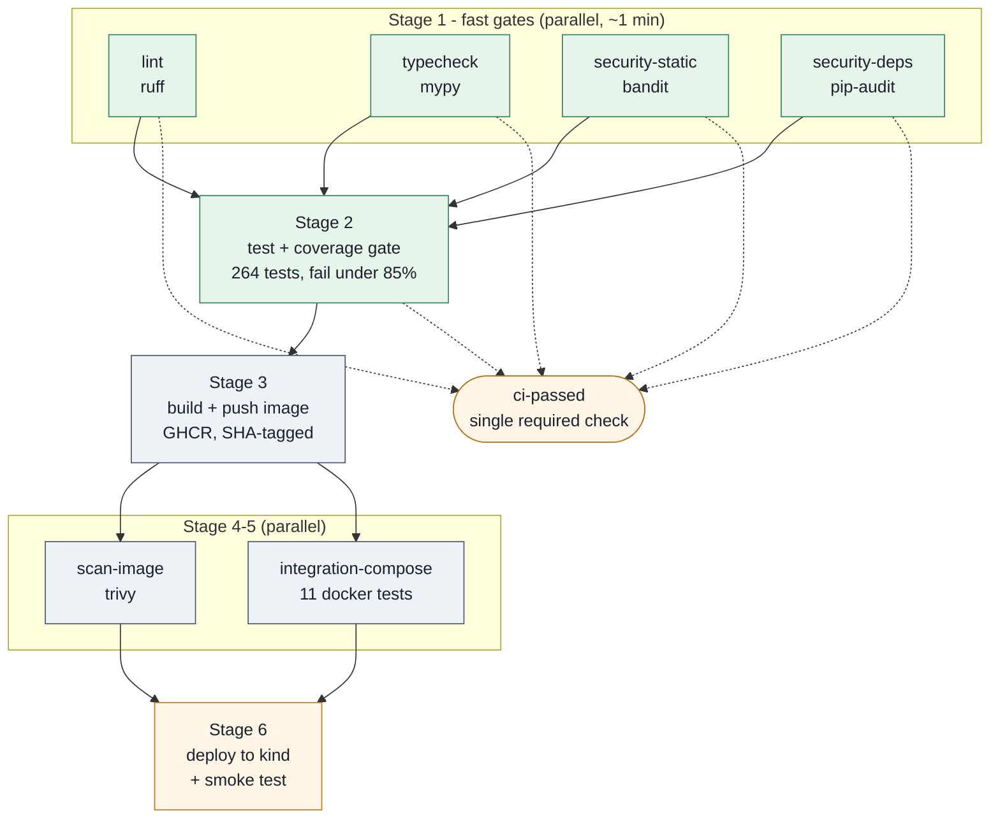

# CI/CD Pipeline

GitHub Actions, defined in [`.github/workflows/ci.yml`](../.github/workflows/ci.yml).
Platform confirmed from the repo's own remote (`github.com/RepoRover/mlkem-modernize`),
so there is no GitLab variant.

Every stage below is explained in terms of **the specific failure it exists to
catch**. A gate that cannot fail is theatre; each one here has been verified to
fail on the condition it guards.

---

## 1. Pipeline shape



**Triggers:** push to any branch, PRs to `main`, a weekly cron, and manual
dispatch. Build/push and deploy are restricted to `main` — a feature branch
must not be able to publish an image or touch the test environment.

---

## 2. Stages, and what each one catches

### Stage 1a — Lint (`ruff`)

**Catches:** unused imports and variables, shadowed names, mutable default
arguments, unreachable code, import-order drift, naive `datetime` use (session
expiry depends on timezone-aware timestamps), and the flake8-bandit subset for
fast security feedback before bandit runs.

**Why it matters here:** the crypto modules pass a lot of same-shaped `bytes`
around. An unused import or a stale variable is often the visible symptom of a
half-finished refactor in code where a half-finished refactor is dangerous.

Found on first run: **73 issues**, 43 auto-fixable. All resolved — genuine
problems fixed in code, idiomatic patterns (FastAPI's `Body(...)`, subprocess in
the Docker tests) given *scoped, justified* per-file ignores in `pyproject.toml`
rather than blanket suppression.

> **Not included: `ruff format --check`.** It would reformat 18 files, and much
> of this code is hand-aligned for readability (transcript field lists, table-ish
> dicts). Adding it would be a large, noisy diff that buries real review. Worth
> reconsidering as a separate, deliberate commit.

### Stage 1b — Type check (`mypy`)

**Catches:** the class of bug the tests are worst at — a `None` reaching a
function expecting `bytes`, a renamed field, arguments passed in the wrong
order to a handshake helper whose parameters are all `bytes`.

**Settings:** `disallow_untyped_defs`, `check_untyped_defs`, `no_implicit_optional`,
`warn_unused_ignores`, `warn_unreachable`, `strict_equality` on `services/`.
Verified achievable — `services/` was already clean. Not `--strict`: that flags
`Any` returns from `response.json()` and third-party stubs we do not control,
which is noise, not signal.

Status: **clean across all 32 files** including tests and scripts.

### Stage 1c — Static security analysis (`bandit`)

**Catches:** insecure primitives (MD5, DES), `shell=True`, unsafe `yaml`/`pickle`,
hardcoded credentials, SQL built by string concatenation.

Found on first run: 12 issues. Resolved as follows —

| Finding | Assessment |
|---|---|
| `B101` assert_used ×9 | 5 in production code **replaced with explicit raises** — asserts vanish under `python -O`, which would turn a clear failure into a confusing `AttributeError`. The rest are in test/benchmark code; `B101` is skipped there with a recorded reason. |
| `B104` bind-all-interfaces ×2 | **Correct inside a container.** Reachability is decided by the compose port map / k8s Service, not the bind address. Targeted `# nosec B104`. |
| `B608` SQL construction ×1 | **False positive.** The `WHERE` fragments are hardcoded literals; every caller value is bound through a `?` placeholder. Targeted `# nosec B608` with the reasoning above the line. |

Every suppression names its specific check. There is no repo-wide `# nosec`.

### Stage 1d — Dependency vulnerability scan (`pip-audit`)

**Catches:** known CVEs anywhere in the dependency tree, including transitive
packages we never chose. Audits `requirements.txt` rather than the resolved
venv, so the result matches what a fresh install produces.

**This gate has already paid for itself.** On its first run it found
**12 CVEs in `starlette` 0.48.0**, pulled in transitively by a stale
`fastapi<0.120` pin:

```
PYSEC-2026-161, -248, -249, -1942, -2280, -2281   fixed in starlette >= 1.3.1
```

Nothing in our code was wrong; the pin was simply old. Fixed by moving to
`fastapi>=0.141` and pinning `starlette>=1.3.1` directly so a transitive
downgrade is caught. **264 tests passed unchanged** across that 22-minor-version
jump. Now: *no known vulnerabilities*.

The **weekly cron** exists precisely for this: a CVE can be published against
code nobody touched, so "green last Friday" is not evidence of "safe today".

### Stage 2 — Tests + coverage gate

**Catches:** behavioural regressions, and silent erosion of the test suite.

264 in-process tests (~10 s): parsing, crypto wrappers, both handshakes, the
hybrid PQC path, suite negotiation, downgrade refusal, key rotation, per-direction
key separation, and the full device → gateway → cloud flow.

**Coverage threshold: 85%**, against ~91% actual.

Why 85 and not 91: `services/device/main.py` reads 39% because its replay loop
is exercised only by the Docker suite, where coverage is not collected. Pinning
the gate at the current number would fail correct changes for reasons unrelated
to them. 85 leaves honest headroom while still failing if a test module is
deleted or a feature lands untested.

### Stage 3 — Build & push

**Catches:** "works on my machine" — a dependency that will not install on a
clean base, a Dockerfile that has drifted from the source layout.

**One image serves all three services.** `SERVICE` selects the module at
runtime, so cloud/gateway/device are the same bytes with different env. Verified:
all three modules import from a single built image. This means one thing to scan,
one thing to sign, one thing to roll back.

Tags: branch name, short SHA, and `latest` on `main`. **Deployments reference
the SHA tag** — a moving tag makes "which code is running?" unanswerable.

### Stage 4 — Container image scan (`trivy`)

**Catches:** vulnerable OS packages in `python:3.12-slim` and anything pip-audit
cannot see because it is not a Python dependency. pip-audit and trivy overlap
but do not substitute: pip-audit misses the base image, trivy misses a
requirements pin that has not been installed yet.

Two passes, deliberately:
- **Gate:** fails on HIGH/CRITICAL *with a known fix*. `ignore-unfixed` is
  intentional — a CVE with no available patch cannot be actioned by us, and
  blocking every build on it trains people to ignore the scanner.
- **Report:** full SARIF including unfixed findings, uploaded to the Security
  tab so they stay visible and tracked.

### Stage 5 — Integration against the real compose stack

**Catches:** what in-process tests structurally cannot — keygen ordering, volume
permissions for the non-root user, healthchecks, `depends_on` conditions,
service DNS resolution.

11 tests that replay all 366 readings through real containers and assert hybrid
PQC was negotiated with zero classical fallback.

### Stage 6 — Deploy to test (kind) + smoke test

**Catches:** deployment-shaped failures that no earlier stage sees — a missing
Secret, an env var that exists in compose but not in the manifests, a probe that
never passes, a Service name the gateway cannot resolve.

A single-node Kubernetes cluster is created on the runner, the manifests in
[`deploy/k8s/`](../deploy/k8s/) are applied, rollout is awaited, and the smoke
test runs against a port-forwarded cloud API. The cluster is destroyed
afterwards regardless of outcome.

On failure it dumps pod status, descriptions, per-service logs and cluster
events — because a deploy that fails in CI with no diagnostics just moves the
debugging to someone's laptop.

---

## 3. The smoke test

[`scripts/smoke_test.py`](../scripts/smoke_test.py). 10 checks in 4 groups.

The point: **a 200 from `/health` proves the process started. It does not prove
the system works.** These checks distinguish "running" from "working":

| Group | Catches |
|---|---|
| health | crash-loop, wrong port, image failed to start |
| data flow | keys secret not mounted, gateway cannot resolve the cloud, device cannot reach the gateway |
| **post-quantum** | **silent downgrade to classical** — the failure this whole project exists to prevent |
| read API | storage wired but unreadable, schema mismatch |

### Verified to fail when it should

Both negative cases were executed, not assumed:

**Nothing deployed** → exits 1 at the health check.

**Stack fully up but classical-only** → exits 1. The system was *healthy by every
conventional measure*: 288 readings stored, zero rejections, `/health` returning
200. A naive health check passes this. The smoke test fails it:

```
[3/4] post-quantum key establishment
      policy=classical-only hybrid=0 classical=3 refused=0
  FAIL  hop 2 negotiated hybrid PQC  (handshakes_hybrid=0)
  FAIL  no classical fallback occurred  (handshakes_classical=3)
  FAIL  pqc_fraction is 1.0  (pqc_fraction=0.0)
```

That is the check worth having.

---

## 4. Secrets

**No key material is in this repository.** `keys/` and `*.pem` are gitignored,
and CI generates ephemeral development keys at deploy time:

```yaml
- run: |
    python scripts/gen_keys.py --out keys
    kubectl -n weather create secret generic wx-keys --from-file=keys/ ...
    rm -rf keys
```

The keys exist only for the life of the job and die with the cluster. Pods mount
them from the Secret at `/keys`, read-only, mode `0440` so the non-root user can
read them and nobody else can.

Registry credentials use the automatic `GITHUB_TOKEN`, minted per run and expiring
with it. No long-lived credential exists anywhere. Job permissions are least-
privilege: the workflow defaults to `contents: read`, and only `build` gets
`packages: write`.

> **This is a test-environment shortcut and is deliberate.** A production
> pipeline would not generate its own keys — it would fetch them from a KMS or
> HSM using an OIDC-federated identity, with no static credential in CI at all.
> Recorded in DECISIONS.md rather than left implied.

---

## 5. Running the gates locally

Identical to what CI runs, so a red build can be reproduced without pushing:

```bash
pip install -r requirements-dev.txt

ruff check .                                              # lint
mypy                                                      # typecheck
bandit -c pyproject.toml -r services scripts -ll          # static security
pip-audit -r requirements.txt                             # dependency CVEs
pytest --cov=services --cov-report=term-missing           # tests + coverage
pytest -m docker                                          # compose integration

# post-deploy check against any running stack
python scripts/smoke_test.py --cloud-url http://127.0.0.1:8000
```

All configuration lives in `pyproject.toml` — one reviewable place for every
rule, threshold and justified exception.

---

## 6. Branch protection

`ci-passed` aggregates the five Stage-1/2 gates into **one** required status
check. Requiring a list of job names means the list rots silently every time a
job is added or renamed; requiring one aggregate does not.

Suggested settings for `main`: require `ci-passed`, require branches up to date,
require one review.

---

## 7. Known gaps

Stated rather than implied:

1. **The workflow has not been executed on GitHub.** Every stage was reproduced
   locally — all five gates, the compose suite, the image build, the single-image
   assumption, and the smoke test in both passing and failing states. But
   runner-specific behaviour (kind startup, GHCR auth, trivy action, SARIF
   upload) is **unverified** until the first real run. Expect to iterate once.
2. **No deployment to anything persistent.** The kind cluster is created and
   destroyed per run. There is no staging or production environment, no rollback
   procedure, and no release versioning beyond image tags.
3. **`ruff format` is not enforced** — see Stage 1a.
4. **No SBOM generation** and **no image signing** (cosign/sigstore). For a
   project about supply-chain-adjacent security, both are natural next steps.
5. **Trivy's `ignore-unfixed`** means an unfixable HIGH will not block. Visible
   in the SARIF report, but nothing forces anyone to look.
6. **Coverage is not tracked over time** — the gate is absolute, so slow erosion
   from 91% toward 85% would go unnoticed.
7. **`kubectl apply` with `sed` substitution** is the crudest possible templating.
   Kustomize or Helm would be better if the manifests grow.
